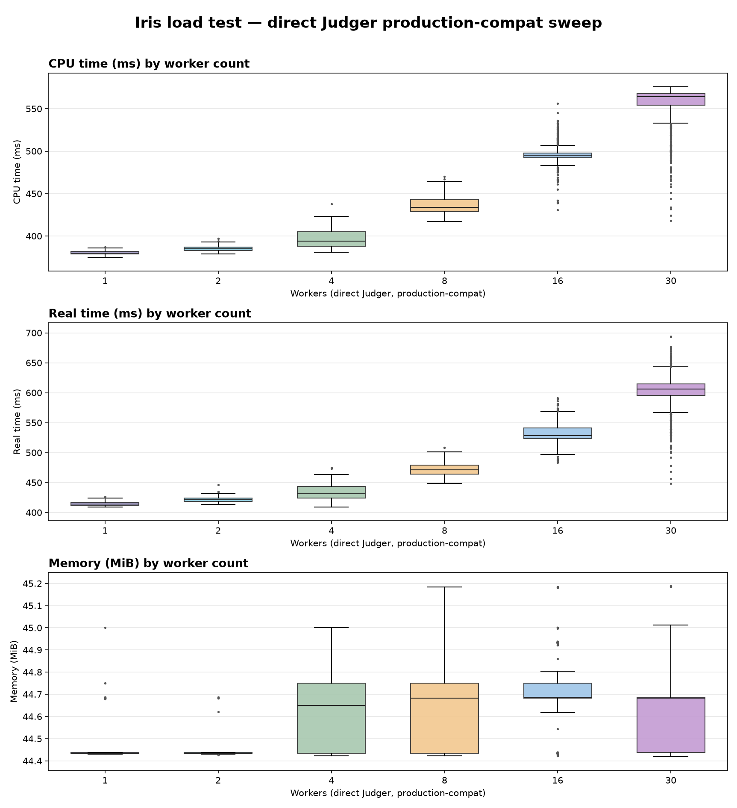

# Wave 1 comparison — reference and direct-suite reproduction

This note records the original Wave 1 Iris load test and the matched
direct-suite reproduction produced by this toolset. It exists so the reference
values for the one-worker case, the submission counts, and the runtime
estimates are pinned next to the code that reproduces them.

The original test ran the full Iris service (Iris replicas + RabbitMQ + judge
DB) on server8 and is documented privately. The reproduction here uses the
direct Judger suite in `production-compat` mode, so it exercises the same
host CPU behaviour without the Iris service layer.

## Reference: original Wave 1

Submission counts and total runtime per concurrency level:

| Iris replicas | Messages | Samples | Runtime |
| ---: | ---: | ---: | ---: |
| 1 (Experiment A, intrinsic) | 1 | 150 | 62.1 s |
| 1 (Experiment C) | 50 | 50 | 69.7 s |
| 2 | 100 | 100 | 70.6 s |
| 4 | 200 | 200 | 73.9 s |
| 8 | 400 | 400 | 81.4 s |
| 16 | 800 | 800 | 93.9 s |
| 30 | 1500 | 1500 | 165.1 s |

Reference CPU/real/memory medians and CV (percent) for the original:

| Replicas | CPU median (ms) | CPU CV | Real median (ms) | Real CV | Memory (MiB) |
| ---: | ---: | ---: | ---: | ---: | ---: |
| 1 (A) | 367.0 | 6.18 | 409.0 | 5.93 | 44.8 |
| 1 (C) | 365.0 | 5.33 | 410.0 | 5.44 | 44.8 |
| 2 | 376.0 | 7.05 | 418.0 | 7.19 | 44.8 |
| 4 | 379.5 | 6.48 | 427.0 | 6.36 | 44.9 |
| 8 | 429.0 | 9.31 | 475.0 | 8.70 | 44.9 |
| 16 | 477.0 | 17.58 | 525.5 | 16.36 | 44.9 |
| 30 | 771.0 | 35.21 | 856.0 | 34.57 | 45.0 |

## Reproduction: direct Judger production-compat sweep

Measured on the same host (server8) with `config/wave1-sweep.json`, the pinned
benchmark image, and 50 executions per worker. Level 1 uses 150 executions to
match Experiment A.

| Workers | Samples | Runtime | CPU median (ms) | CPU CV | Real median (ms) | Real CV | Memory (MiB) |
| ---: | ---: | ---: | ---: | ---: | ---: | ---: | ---: |
| 1 | 150 | 64.3 s | 380 | 0.60 | 414 | 0.78 | 44.4 |
| 2 | 100 | ~25 s | 385 | 0.86 | 421 | 1.29 | 44.4 |
| 4 | 200 | ~25 s | 394 | 2.52 | 431 | 2.79 | 44.7 |
| 8 | 400 | ~25 s | 434 | 1.93 | 471 | 2.39 | 44.7 |
| 16 | 800 | ~28 s | 495 | 2.21 | 528 | 2.72 | 44.7 |
| 30 | 1500 | ~35 s | 564 | 3.80 | 606 | 4.44 | 44.7 |

One-worker reference match:

| Metric | Original (Experiment A) | Reproduction |
| --- | ---: | ---: |
| Samples | 150 | 150 |
| Runtime | 62.1 s | 64.3 s |
| CPU median | 367.0 ms | 380 ms |
| Real median | 409.0 ms | 414 ms |
| Memory median | 44.8 MiB | 44.4 MiB |



## Reading the result

- The reproduction shows the same shape as the original: median CPU and real
  time rise with concurrency and the distribution widens from 16 workers on.
- Magnitudes are lower at high concurrency because the direct suite has no Iris,
  RabbitMQ, compile, or Kubernetes scheduling in the measured interval. The
  original CPU time roughly doubled by 30 replicas; the reproduction rises by
  about 48 percent.
- The submission counts match exactly (150/50/100/200/400/800/1500 by level).
  The one-worker runtime matches within about 3.5 percent.
- Memory is held near the reference by the fixture's fixed working set.

## Reproducing

```bash
# 1. Provision and qualify the host (see docs/WAVE1-REPLICATION.md).
# 2. Build the direct workload and the benchmark image, then capture its image id.
g++ -DONLINE_JUDGE -O2 -Wall -std=c++14 fixtures/cpp-runtime-v1/source.cpp -lm -o /tmp/cpp-runtime-v1

# 3. Run each level, then collect.
iris-benchctl run --config config/wave1-sweep.json --profile ladder-<N> \
  --production-compat --benchmark-image sha256:<image-id> ... --run-id iris-<date>-wave-<N>
iris-benchctl collect --config config/wave1-sweep.json --run iris-<date>-wave-<N>

# 4. Plot.
uv run analysis/plot-ladder.py \
  --run 1=runs/<run-1> --run 2=runs/<run-2> --run 4=runs/<run-4> \
  --run 8=runs/<run-8> --run 16=runs/<run-16> --run 30=runs/<run-30> \
  --out wave1-direct-sweep.png
```

These are uncontained `production-compat` runs: the alpha.4 Judger submission
escapes to the host-root sandbox cgroup and uses every CPU, which is exactly the
behaviour the original test exposed. The runs are therefore accepted but marked
non-comparable, and must not be merged with isolated-profile populations.
